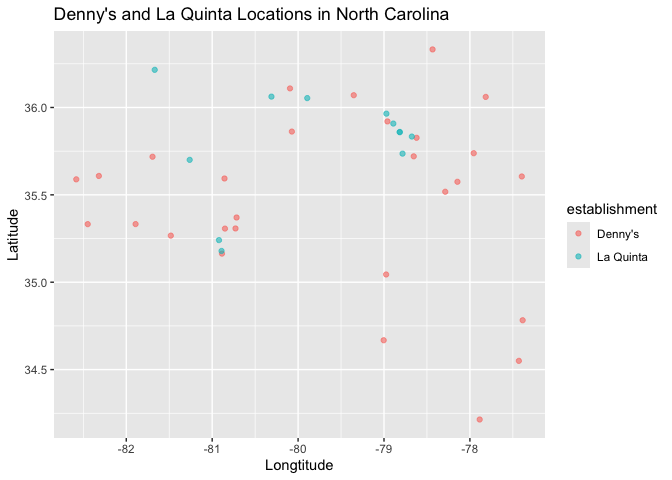
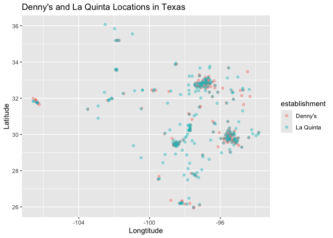

Lab 04 - La Quinta is Spanish for next to Denny’s, Pt. 1
================
Lily Botha
02/05/2026

### Load packages and data

``` r
library(tidyverse) 
library(dsbox) 
```

``` r
states <- read_csv("data/states.csv")
```

### Exercise 1

The Denny’s dataset has 1643 rows and 6 columns. Each row represents a
Denny’s restaurant. The columns are the variables: address, city, state,
zip, longitude, and latitude.

``` r
dn <- dennys
nrow(dn)
```

    ## [1] 1643

``` r
ncol(dn)
```

    ## [1] 6

### Exercise 2

The La Quinta dataset has 909 rows and 6 columns. Each row represents a
La Quinta hotel. The columns are the variables: address, city, state,
zip, longitude, and latitude.

``` r
lq <- laquinta
nrow(lq)
```

    ## [1] 909

``` r
ncol(lq)
```

    ## [1] 6

### Exercise 3

There are La Quinta hotels outside of the US: in Asia, New Zealand,
Georgia, Turkey, United Arab Emirates, Colombia, and Ecuador. All of the
Denny’s are located in the US.

### Exercise 4

One possibility is to filter by longitude and latitude, which would
require finding out the coordinate range of the US. I think a simpler
option would be to filter by the state abbreviations, and anything
outside of the US’s 50 states would be cut. Its also possible that the
address of locations outside the US is formatted differently, so we
could filter that way, but that seems risky.

### Exercise 5

There are 0 Denny’s locations outside the US.

``` r
dn %>%
  filter(!(state %in% states$abbreviation)) #filter for states that are not in states$abbreviation
```

    ## # A tibble: 0 × 6
    ## # ℹ 6 variables: address <chr>, city <chr>, state <chr>, zip <chr>,
    ## #   longitude <dbl>, latitude <dbl>

### Exercise 6

``` r
dn <- dn %>%
  mutate(country = "United States") #add a country variable to Denny's dataset and set all observations to "United States"
```

### Exercise 7

There are La Quinta locations in Asia, New Zealand, Georgia, Turkey,
United Arab Emirates, Colombia, and Ecuador.

``` r
lq %>%
  filter(!(state %in% states$abbreviation)) #filter for states that are not in states$abbreviation
```

    ## # A tibble: 14 × 6
    ##    address                                  city  state zip   longitude latitude
    ##    <chr>                                    <chr> <chr> <chr>     <dbl>    <dbl>
    ##  1 Carretera Panamericana Sur KM 12         "\nA… AG    20345    -102.     21.8 
    ##  2 Av. Tulum Mza. 14 S.M. 4 Lote 2          "\nC… QR    77500     -86.8    21.2 
    ##  3 Ejercito Nacional 8211                   "Col… CH    32528    -106.     31.7 
    ##  4 Blvd. Aeropuerto 4001                    "Par… NL    66600    -100.     25.8 
    ##  5 Carrera 38 # 26-13 Avenida las Palmas c… "\nM… ANT   0500…     -75.6     6.22
    ##  6 AV. PINO SUAREZ No. 1001                 "Col… NL    64000    -100.     25.7 
    ##  7 Av. Fidel Velazquez #3000 Col. Central   "\nM… NL    64190    -100.     25.7 
    ##  8 63 King Street East                      "\nO… ON    L1H1…     -78.9    43.9 
    ##  9 Calle Las Torres-1 Colonia Reforma       "\nP… VE    93210     -97.4    20.6 
    ## 10 Blvd. Audi N. 3 Ciudad Modelo            "\nS… PU    75010     -97.8    19.2 
    ## 11 Ave. Zeta del Cochero No 407             "Col… PU    72810     -98.2    19.0 
    ## 12 Av. Benito Juarez 1230 B (Carretera 57)… "\nS… SL    78399    -101.     22.1 
    ## 13 Blvd. Fuerza Armadas                     "con… FM    11101     -87.2    14.1 
    ## 14 8640 Alexandra Rd                        "\nR… BC    V6X1…    -123.     49.2

### Exercise 8

``` r
lq <- lq %>%
  mutate(country = case_when(
    state %in% state.abb ~ "United States",
    state %in% c("ON", "BC") ~ "Canada",
    state == "ANT" ~ "Colombia",
    state %in% c("AG", "QR", "CH", "NL", "VE", "PU", "SL") ~ "Mexico"
  )) #add a new country variable based on state abbreviations
```

``` r
lq <- lq %>%
  filter(country == "United States")
```

### Exercise 9

The state with the highest number of Denny’s locations is California,
with 403. It is surprising that Texas (the second highest) only has 200.
The state with the least amount of Denny’s is Delaware, with only 1.

``` r
dn %>% count(state, sort = TRUE) #count frequency of states, sort in descending order
```

    ## # A tibble: 51 × 2
    ##    state     n
    ##    <chr> <int>
    ##  1 CA      403
    ##  2 TX      200
    ##  3 FL      140
    ##  4 AZ       83
    ##  5 IL       56
    ##  6 NY       56
    ##  7 WA       49
    ##  8 OH       44
    ##  9 MO       42
    ## 10 PA       40
    ## # ℹ 41 more rows

``` r
dn %>% count(state) %>% arrange(n) #sort in ascending order
```

    ## # A tibble: 51 × 2
    ##    state     n
    ##    <chr> <int>
    ##  1 DE        1
    ##  2 DC        2
    ##  3 VT        2
    ##  4 AK        3
    ##  5 IA        3
    ##  6 NH        3
    ##  7 SD        3
    ##  8 WV        3
    ##  9 LA        4
    ## 10 MT        4
    ## # ℹ 41 more rows

The state with the highest number of La Quinta locations is Texas, with
237. Maine has the least, with only 1. I think this makes more sense
because of how big Texas is. Overall, it makes sense that Texas has both
a very high number of Denny’s and La Quinta’s, given the point of the
lab.

``` r
lq %>% count(state, sort = TRUE)
```

    ## # A tibble: 48 × 2
    ##    state     n
    ##    <chr> <int>
    ##  1 TX      237
    ##  2 FL       74
    ##  3 CA       56
    ##  4 GA       41
    ##  5 TN       30
    ##  6 OK       29
    ##  7 LA       28
    ##  8 CO       27
    ##  9 NM       19
    ## 10 NY       19
    ## # ℹ 38 more rows

``` r
lq %>% count(state) %>% arrange(n)
```

    ## # A tibble: 48 × 2
    ##    state     n
    ##    <chr> <int>
    ##  1 ME        1
    ##  2 AK        2
    ##  3 NH        2
    ##  4 RI        2
    ##  5 SD        2
    ##  6 VT        2
    ##  7 WV        3
    ##  8 WY        3
    ##  9 IA        4
    ## 10 MI        4
    ## # ℹ 38 more rows

### Exercise 10

The District of Colombia, Rhode Island, and California have the most
Denny’s locations per thousand square miles.

``` r
dn %>%
  count(state) %>% #count how many observations are in each state
  inner_join(states, by = c("state" = "abbreviation")) %>% #join states df to count df, specify that the state variable from dn df should be matched by the abbreviation variable from states df
  mutate(dn_density = (n / area) * 1000) %>% 
  arrange(desc(dn_density))
```

    ## # A tibble: 51 × 5
    ##    state     n name                     area dn_density
    ##    <chr> <int> <chr>                   <dbl>      <dbl>
    ##  1 DC        2 District of Columbia     68.3     29.3  
    ##  2 RI        5 Rhode Island           1545.       3.24 
    ##  3 CA      403 California           163695.       2.46 
    ##  4 CT       12 Connecticut            5543.       2.16 
    ##  5 FL      140 Florida               65758.       2.13 
    ##  6 MD       26 Maryland              12406.       2.10 
    ##  7 NJ       10 New Jersey             8723.       1.15 
    ##  8 NY       56 New York              54555.       1.03 
    ##  9 IN       37 Indiana               36420.       1.02 
    ## 10 OH       44 Ohio                  44826.       0.982
    ## # ℹ 41 more rows

Rhode Island, Florida, and Connecticut have the most La Quinta locations
per thousand square miles.

``` r
lq %>%
  count(state) %>%
  inner_join(states, by = c("state" = "abbreviation")) %>%
  mutate(lq_density = (n / area) * 1000) %>% 
  arrange(desc(lq_density))
```

    ## # A tibble: 48 × 5
    ##    state     n name             area lq_density
    ##    <chr> <int> <chr>           <dbl>      <dbl>
    ##  1 RI        2 Rhode Island    1545.      1.29 
    ##  2 FL       74 Florida        65758.      1.13 
    ##  3 CT        6 Connecticut     5543.      1.08 
    ##  4 MD       13 Maryland       12406.      1.05 
    ##  5 TX      237 Texas         268596.      0.882
    ##  6 TN       30 Tennessee      42144.      0.712
    ##  7 GA       41 Georgia        59425.      0.690
    ##  8 NJ        5 New Jersey      8723.      0.573
    ##  9 MA        6 Massachusetts  10554.      0.568
    ## 10 LA       28 Louisiana      52378.      0.535
    ## # ℹ 38 more rows

### Exercise 11

``` r
dn <- dn %>%
  mutate(establishment = "Denny's")
lq <- lq %>%
  mutate(establishment = "La Quinta") #add identifier variable called "establishment" and set value to Denny's and La Quinta for dn and lq dfs
```

``` r
dn_lq <- bind_rows(dn, lq) #bind dn and lq dfs
```

It appears that Mitch’s joke holds about half the time for North
Carolina. Almost all of the La Quinta’s are located next to a Denny’s,
but there are a few Denny’s without a La Quinta nearby.

``` r
dn_lq %>% 
  filter(state == "NC") %>% 
  ggplot(dn_lq, mapping = aes(
    x = longitude,
    y = latitude,
    color = establishment
  )) +
    geom_point(alpha = .6) + 
  labs(title = "Denny's and La Quinta Locations in North Carolina",
       x = "Longtitude",
       y = "Latitude", 
       fill = "Establishment"
  )
```

<!-- -->

### Exercise 12

Mitch’s joke appears to hold more true for Texas compared to North
Carolina.

``` r
dn_lq %>% 
  filter(state == "TX") %>% 
  ggplot(dn_lq, mapping = aes(
    x = longitude,
    y = latitude,
    color = establishment
  )) +
    geom_point(alpha = .4) + 
  labs(title = "Denny's and La Quinta Locations in Texas",
       x = "Longtitude",
       y = "Latitude", 
       fill = "Establishment"
  )
```

<!-- -->

### Exercise 13

(I want to come back to this if I have time next week)
